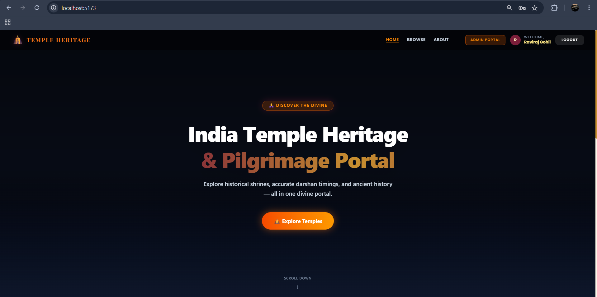
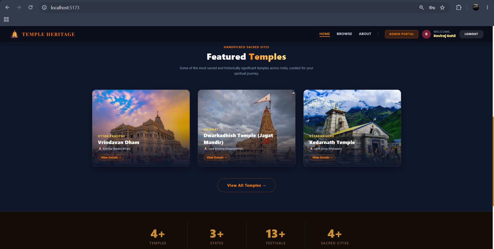
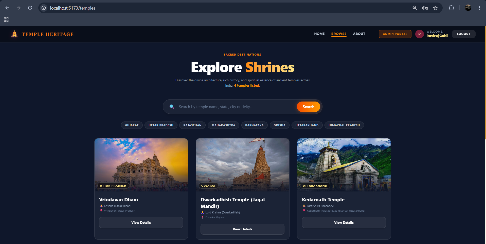
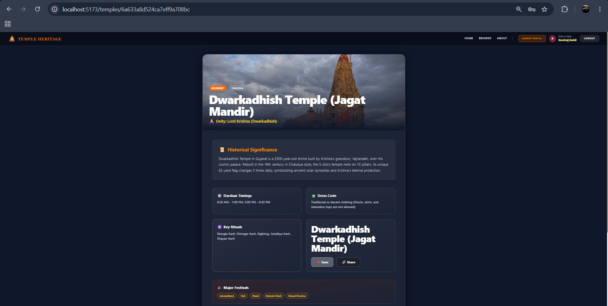
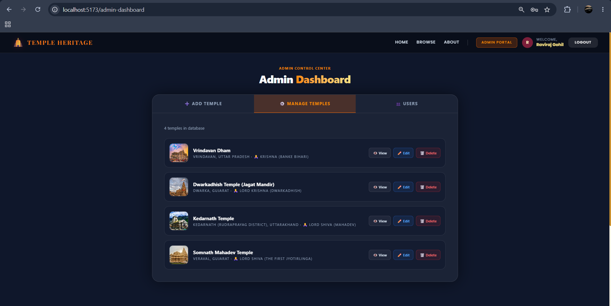
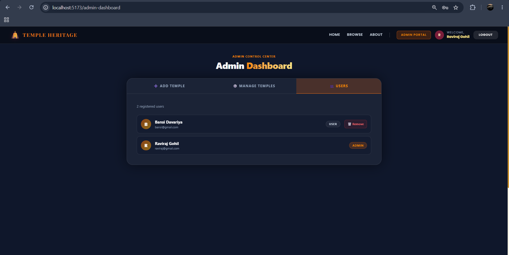
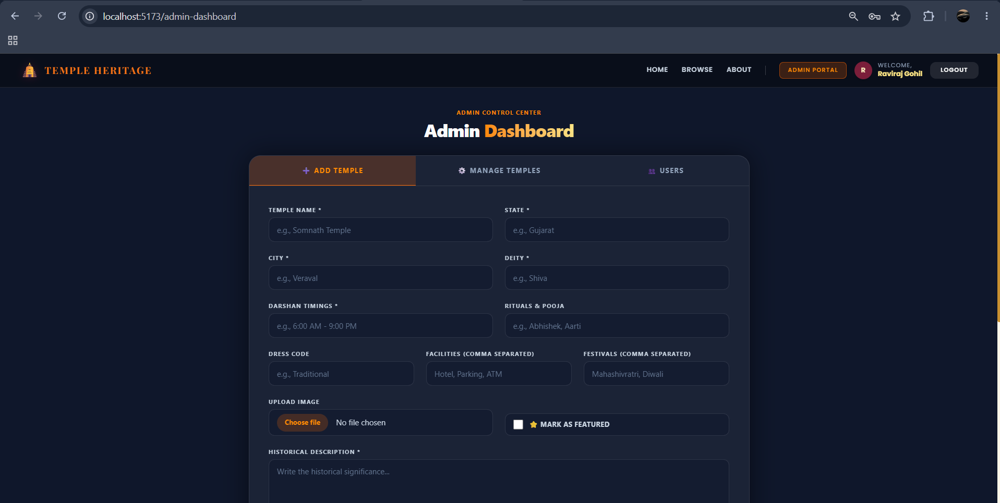

# 🛕 India Temple Heritage & Pilgrimage Portal

A comprehensive digital directory providing verified information about ancient and modern temples across India. It serves as a guide for devotees, offering details on darshan timings, dress codes, rituals, festivals, and nearby facilities.

## 🌟 Key Features
- **Guest Access:** Browse and search temples by name, state, deity, and city.
- **Devotee Experience (Logged In):** Save and bookmark temples for future reference.
- **Admin Control:** Secure admin portal to add, edit, or delete temple records.
- **Responsive UI:** Beautiful dark theme with saffron and gold accents built with Tailwind CSS.

## 💻 Tech Stack
Built using the **MERN** stack (MongoDB, Express, React, Node.js).

**Frontend (Client)**
- **React.js (Vite):** Core UI framework
- **React Router DOM:** Page navigation
- **Tailwind CSS (v4):** Styling and responsive layout
- **Axios:** API requests

**Backend (Server)**
- **Node.js & Express.js:** Server logic and API endpoints
- **MongoDB & Mongoose:** Database and schema modeling
- **JWT (jsonwebtoken):** Authentication and secure route protection
- **Bcrypt.js:** Secure password hashing
- **Multer:** Handling image uploads
- **CORS & Dotenv:** Security and environment configurations

## 📸 Screenshots & Features

Here is a glimpse of what the portal looks like:

### 1. Home Page (Hero & Featured)


*The landing page features a stunning full-screen hero section with a dark glassmorphism navbar, followed by a curated list of featured temples and real-time database statistics.*

### 2. Browse Temples

*Users can search temples by name or deity, and use interactive state filter chips to narrow down the list. Results are displayed in beautiful grid cards with tags and details.*

### 3. Temple Details

*A comprehensive details page showing darshan timings, history, dress code, and festivals celebrated. Logged-in users can also bookmark the temple directly from this page.*

### 4. Admin Dashboard (Manage & Add)

**Manage Temples & Users:**


*Admins have full access to monitor registered users, assign roles, and manage the complete temple directory directly from intuitive data tables.*

**Add New Temple:**

*A secure, protected form for admins to easily add new temples, upload high-quality images, and insert detailed historical and timing information into the database.*

## 🚀 How to Run Locally

1. **Install Dependencies**
   ```bash
   # Backend
   cd server
   npm install

   # Frontend
   cd ../client
   npm install
   ```

2. **Start the Servers**
   ```bash
   # Backend (runs on port 5000)
   cd server
   npm start

   # Frontend (runs on port 5173)
   cd client
   npm run dev
   ```

---